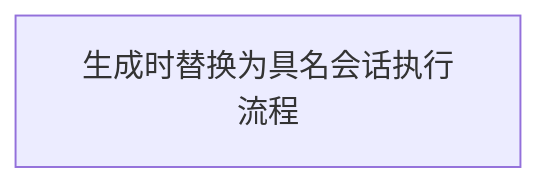

# {{parent_task_id}}：{{title}}

> 任务包所属仓库：{{packet_repository}}。本卡入口相对于该仓库根：{{packet_path}}。
> 生成日期：{{date}}。材料状态：{{distribution_state}}。活动状态权威来源：{{issue_or_project_source}}。

## 已确认需求与来源

{{confirmed_requirements_with_ids_and_repository_relative_sources}}

## 目标与非目标

{{goals_and_non_goals}}

## 路径和项目约束

{{repository_identities_relative_path_anchors_applicable_rules_and_permissions}}

## 子任务与需求覆盖

| Task | 独立交付结果 | 仓库 | 需求与验收编号 | 前置条件 | Worker 卡 | Reviewer 卡 |
| --- | --- | --- | --- | --- | --- | --- |
{{task_rows_with_exact_repository_and_relative_paths}}

## 执行模式与阶段

- 执行模式及选择来源：{{execution_mode_and_selection_source}}
- 资源档位及选择来源：{{resource_profile_and_selection_source}}
- 速度策略及选择来源：{{speed_policy_and_selection_source}}
- 执行载体及能力前置条件：{{session_carrier_and_required_runtime_capabilities}}
- Main 会话名称：{{main_session_name}}
- 并发容量、调度授权与停止点：{{concurrency_authorized_dispatch_scope_and_stop}}
- 运行状态权威入口：{{runtime_state_repository_and_relative_path_or_existing_issue}}

{{mode_specific_execution_summary_and_applicable_stage_table}}

## 模型目录与逐会话绑定

- 绑定就绪状态：{{ready_for_dispatch_or_model_binding_blocked}}
- 目录来源、检查时间和宿主范围：{{catalog_source_checked_at_timezone_and_host_scope}}
- 可用提供方、模型、推理强度与服务层：{{verified_catalog_capabilities}}
- 计价依据与未知项：{{cost_basis_checked_at_and_unknowns}}
- Main 启动时刷新条件：{{catalog_revalidation_and_refresh_conditions}}

| 会话名称 | provider | model | reasoning_effort | service_tier / control / parameter | 选择理由 | 关键路径 |
| --- | --- | --- | --- | --- | --- | --- |
{{exact_per_session_primary_bindings_and_critical_path_rows}}

| 会话名称 | 有序 fallbacks | escalation 触发条件 | dispatch retry 上限 | model escalation 上限 |
| --- | --- | --- | --- | --- |
{{per_session_fallback_escalation_and_finite_limit_rows}}

创建或续接时使用准确值；不得省略模型参数以继承 Main。服务层控制明确写成 `per-session`、`host-global` 或 `unavailable`，并登记实际参数或 `none`。Fast 不可用时按策略使用标准服务层，不联动更换模型。

## 具体会话名册

| 会话名称 | Task / 角色 | 工作内容 | 阶段 | 仓库与卡片相对路径 | 启动者 / 新建或续接 / 条件 |
| --- | --- | --- | --- | --- | --- |
{{concrete_session_roster_rows_matching_cards_diagram_and_prompts}}

## 会话执行流程图

本图表示计划执行关系，不表示已执行。实线表示正常执行顺序，虚线表示退回修复；同名会话在不同阶段出现表示续接。条件节点不是新会话，汇合必须满足全部所需前置条件。

<!-- 生成时将下面 Mermaid 围栏内的 TEMPLATE 节点整行替换为 {{named_session_nodes_mode_specific_dispatch_stage_gates_dependency_edges_and_repair_loops}} 对应的具体节点、连线、门禁和回路；最终任务包不得保留 TEMPLATE 节点。 -->

{{parallel_batches_dispatch_actor_session_reuse_stage_confirmations_project_human_gates_and_fast_legend}}

## 执行与集成顺序

{{dependency_order_parallel_waves_shared_file_ownership_and_integration_checks}}

## 角色入口

{{main_card_and_prompt_file_relative_links}}

## 开始前需要具备的材料与环境

{{known_prerequisites_distribution_to_other_machines_and_availability}}

## 生成证据

{{actual_generation_checks_and_unrun_execution_review_merge_states}}
