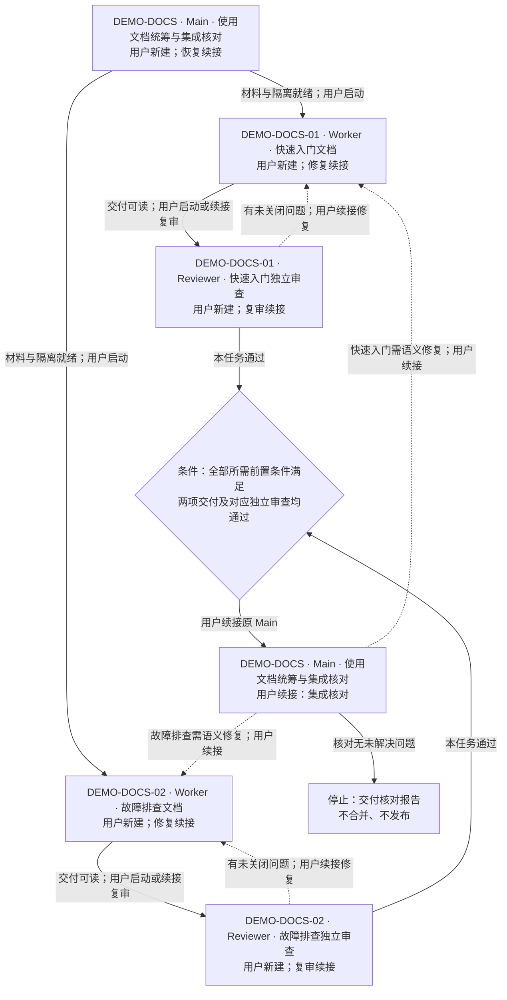

# DEMO-DOCS：Skill 使用文档任务包

> 仓库：`demo-handbook`。根相对入口：`docs/task-packets/DEMO-DOCS/packet.md`。
> 生成日期：2026-09-06。材料状态：本地草案，未提交、未分发。无已有 Issue；未来活动状态由 Main 单独维护 `docs/task-packets/DEMO-DOCS/reports/status.md`（计划创建）。

## 已确认需求与需求核对

来源：[项目 README 原始请求](../../../README.md)；规范：[AGENTS.md](../../../AGENTS.md)。这两份文件已实际读取。生成前核对：目标目录无自己的 Git 元数据、无既有任务包，以下两份文档均不存在；未将外层仓库状态当作本项目状态。

| 需求 | 已确认结果 | Task / 验收 |
| --- | --- | --- |
| R1 | 中文快速入门，按获取完整 Skill 目录、按宿主安装、显式调用、查看结果四步组织，并说明生成计划不会启动业务 | DEMO-DOCS-01 / A1、A2 |
| R2 | 中文故障排查，覆盖卡片缺失、需求不明确、自动调度工具缺失；每种都有可观察现象和下一步 | DEMO-DOCS-02 / A3、A4、A5 |
| R3 | 人工模式，仅生成任务包；无额外人类审查门禁；默认不推送、不合并 | Main 调度边界及两个 Worker 的 B1 |

需求决定缺失：无。可查明事实：输入仅含 README 与 AGENTS.md，无测试设施、Issue 或 ADR。Worker 可决定的局部细节：段落标题、用语和例子。已知执行前置条件：将来需真实目标仓库基线、独立工作区和用户启动；这些尚未准备，不能宣称可立即执行。

## 目标、非目标与路径

计划新建 `demo-handbook` 的 `docs/quickstart.md` 和 `docs/troubleshooting.md`，可分别接受或退回。非目标为安装工具、实际调度、产品代码、发布；本轮仅生成任务包，不写这两份成果。

所有根相对路径都锚定 `demo-handbook`；Markdown 链接相对于链接所在文件。遵守 AGENTS.md 的禁止检查 SHA 规则，不以其他哈希替代。没有额外人类技术审批；用户逐个启动会话是人工推进方式，不是审查通过。默认不推送、不创建远端资源、不合并、不发布。

## 子任务与需求覆盖

| Task | 独立交付结果（计划创建） | 仓库 | 需求与验收 | 前置条件 | Worker 卡 | Reviewer 卡 |
| --- | --- | --- | --- | --- | --- | --- |
| DEMO-DOCS-01 | `docs/quickstart.md` | demo-handbook | R1、R3 / A1、A2、B1 | 输入和卡片可读；独立分支/worktree 就绪；用户启动 | [快速入门](workers/DEMO-DOCS-01.md) | [快速入门独立审查](reviews/DEMO-DOCS-01.md) |
| DEMO-DOCS-02 | `docs/troubleshooting.md` | demo-handbook | R2、R3 / A3、A4、A5、B1 | 输入和卡片可读；独立分支/worktree 就绪；用户启动 | [故障排查](workers/DEMO-DOCS-02.md) | [故障排查独立审查](reviews/DEMO-DOCS-02.md) |

两个叶子无相互依赖，允许同一批次最多两个 Worker 并行。各自只写自己的文档和交接报告，不写总卡、另一份文档或共享状态；Reviewer 各自只写自己的审查报告。Main 是活动状态和集成核对报告的唯一写入者。

## 执行模式

- 模式：`manual`，来自用户明确选择。
- 执行载体：用户手动创建的独立会话；不是内部子 Agent 自动委派。无需自动调度工具；文件读取和隔离工作区是否可用在未来启动时核对。
- Main：`DEMO-DOCS · Main · 使用文档统筹与集成核对`。只给下一步、条件和提示词，不自动创建、委派或发送触发执行的续接消息。
- 只有用户发送对应提示词才开始该会话工作。修复、复审、Main 集成也逐次由用户续接；Worker/Reviewer 完成本卡工作后交付并等待。
- 停止点：两份文档及独立审查完成后，Main 做只读集成核对并交付报告；不合并、不发布。所有业务节点目前均为 UNRUN。

## 具体会话名册

以下卡片路径全部相对于仓库 `demo-handbook` 根。计划名不代表会话已创建；当前没有实际会话 ID。

| 会话名称 | Task / 角色 | 工作内容 | 阶段 | 卡片根相对路径 | 启动者 / 新建或续接 / 条件 |
| --- | --- | --- | --- | --- | --- |
| DEMO-DOCS · Main · 使用文档统筹与集成核对 | DEMO-DOCS / Main | 核对材料、管理交接与集成核对 | 准备、恢复、集成 | `docs/task-packets/DEMO-DOCS/main.md` | 用户 / 新建；恢复、集成续接 / 材料可读；集成需两项审查通过 |
| DEMO-DOCS-01 · Worker · 快速入门文档 | DEMO-DOCS-01 / Worker | 编写快速入门及本任务修复 | 实施、修复 | `docs/task-packets/DEMO-DOCS/workers/DEMO-DOCS-01.md` | 用户 / 首次新建，修复续接 / 独立工作区和材料就绪 |
| DEMO-DOCS-02 · Worker · 故障排查文档 | DEMO-DOCS-02 / Worker | 编写故障排查及本任务修复 | 实施、修复 | `docs/task-packets/DEMO-DOCS/workers/DEMO-DOCS-02.md` | 用户 / 首次新建，修复续接 / 独立工作区和材料就绪 |
| DEMO-DOCS-01 · Reviewer · 快速入门独立审查 | DEMO-DOCS-01 / Reviewer | 独立阅读验收与复审 | 审查、复审 | `docs/task-packets/DEMO-DOCS/reviews/DEMO-DOCS-01.md` | 用户 / 首次新建，复审续接 / 本任务交付对象、报告和隔离审查区可读 |
| DEMO-DOCS-02 · Reviewer · 故障排查独立审查 | DEMO-DOCS-02 / Reviewer | 独立阅读验收与复审 | 审查、复审 | `docs/task-packets/DEMO-DOCS/reviews/DEMO-DOCS-02.md` | 用户 / 首次新建，复审续接 / 本任务交付对象、报告和隔离审查区可读 |

## 会话执行流程图

本图表示计划，不表示已执行。人工模式的每次启动和续接均由用户触发。实线为正常顺序，虚线为退回原 Worker 修复；修复完成仍须原 Reviewer 复审。条件节点不创建会话。

## 执行、分发与角色入口

顺序为 Main 准备 → 两个独立 Worker（可并行）→ 各自独立 Reviewer → 全部条件满足 → 原 Main 核对。集成中发现语义问题仍回原 Worker，再由原 Reviewer 复审，不借核对直接修改成果。

[Main 卡](main.md) 管理未来活动状态；[提示词](prompts.md) 提供全部具体会话入口与续接入口。卡片可通过项目允许的文件交付方式共享；用户手动把当前交付对象、卡片和报告提供给接收方，接收方先确认可读。相对路径可解析不证明跨机器已分发或已验收。

当前没有 Git 基线、工作区或业务报告。计划报告路径登记于各角色卡，生成阶段不创建这些报告。未来本地验证为可复查阅读操作，无现有测试命令。

## 生成证据边界

本次已经写入本地任务包。结构、需求覆盖、链接、会话与入口一致性以案例 README 的实测记录为准；这里不保存第二份活动状态。业务实施、阅读验收、独立业务审查、Git 提交、跨机器分发、合并与发布均 UNRUN。Mermaid 仅进行文本一致性检查，渲染 UNRUN。
