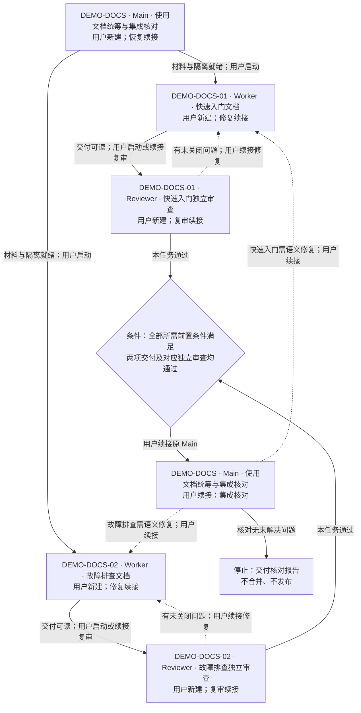

# 本次生成的示例回复

已为仓库 `demo-handbook` 生成本地草案，仓库根相对入口为 `docs/task-packets/DEMO-DOCS/packet.md`。执行模式为人工模式，来自你的明确选择；每次创建或续接会话均由用户触发。

具体会话共五个：

- DEMO-DOCS · Main · 使用文档统筹与集成核对
- DEMO-DOCS-01 · Worker · 快速入门文档
- DEMO-DOCS-02 · Worker · 故障排查文档
- DEMO-DOCS-01 · Reviewer · 快速入门独立审查
- DEMO-DOCS-02 · Reviewer · 故障排查独立审查

本次只生成材料，业务执行、独立业务审查、提交、跨机器分发、合并与发布均 UNRUN。当前 fixture 没有 Git 基线，独立分支与 worktree 需未来执行前准备；项目没有额外人类技术审查门禁。文件和入口的一致性检查结果见 [案例记录](README.md)。Mermaid 仅做文本检查，渲染 UNRUN。

下图是计划执行关系，实线为正常顺序，虚线为退回原 Worker 修复。两个 Worker 可并行；汇合必须等待两项交付与审查均通过。同名节点表示复用原会话，修复后仍需原 Reviewer 复审。



以下每段可单独复制，详细范围和验收留在卡片；生成这些入口没有启动对应会话。

## DEMO-DOCS · Main · 使用文档统筹与集成核对：启动

启动者：用户。首次新建 Main；输入和任务包可读后使用。

```text
你是 DEMO-DOCS 的 Main，会话名称为「DEMO-DOCS · Main · 使用文档统筹与集成核对」。定位实施和卡片仓库 demo-handbook，从仓库根读取 docs/task-packets/DEMO-DOCS/main.md 及其总卡。按人工模式核对材料、隔离前置条件和已有会话；不要自动创建、委派或发送续接执行消息，只给出下一步和具体提示词后等待用户启动。遵守卡片的证据读取与权限边界，不编写业务文档，不推送、不合并、不发布。
```

## DEMO-DOCS-01 · Worker · 快速入门文档：实施

启动者：用户。新建独立会话；输入、卡片和独立分支/worktree 就绪后使用。可与 DEMO-DOCS-02 并行。

```text
你是 DEMO-DOCS-01 Worker，会话名称为「DEMO-DOCS-01 · Worker · 快速入门文档」。实施仓库是 demo-handbook，工作目录为本任务独立 worktree 的仓库根；从卡片仓库 demo-handbook 根读取 docs/task-packets/DEMO-DOCS/workers/DEMO-DOCS-01.md。以人工模式在材料和隔离就绪后按卡片编写快速入门、执行阅读验收并交付证据，保留已有改动并遵守证据读取限制。交付后停止等待独立审查，不自行启动其他会话，不因材料缺失猜测需求。
```

## DEMO-DOCS-02 · Worker · 故障排查文档：实施

启动者：用户。新建独立会话；输入、卡片和独立分支/worktree 就绪后使用。可与 DEMO-DOCS-01 并行。

```text
你是 DEMO-DOCS-02 Worker，会话名称为「DEMO-DOCS-02 · Worker · 故障排查文档」。实施仓库是 demo-handbook，工作目录为本任务独立 worktree 的仓库根；从卡片仓库 demo-handbook 根读取 docs/task-packets/DEMO-DOCS/workers/DEMO-DOCS-02.md。以人工模式在材料和隔离就绪后按卡片编写故障排查、执行阅读验收并交付证据，保留已有改动并遵守证据读取限制。交付后停止等待独立审查，不自行启动其他会话，不因材料缺失猜测需求。
```

## DEMO-DOCS-01 · Reviewer · 快速入门独立审查：审查

启动者：用户。新建独立会话；DEMO-DOCS-01 本次交付文件、报告和隔离审查区可读后使用。

```text
你是 DEMO-DOCS-01 的独立 Reviewer，会话名称为「DEMO-DOCS-01 · Reviewer · 快速入门独立审查」，使用全新上下文。审查仓库是 demo-handbook；从卡片仓库 demo-handbook 根读取 docs/task-packets/DEMO-DOCS/reviews/DEMO-DOCS-01.md。以人工模式确认本次交付批次，在独立审查 worktree 的仓库根核对需求、实际文件和作者证据，按卡片独立阅读验收并交付报告后停止。遵守证据读取限制，不修改实现、不自行唤起其他会话，不将作者结论视为已验证事实。
```

## DEMO-DOCS-02 · Reviewer · 故障排查独立审查：审查

启动者：用户。新建独立会话；DEMO-DOCS-02 本次交付文件、报告和隔离审查区可读后使用。

```text
你是 DEMO-DOCS-02 的独立 Reviewer，会话名称为「DEMO-DOCS-02 · Reviewer · 故障排查独立审查」，使用全新上下文。审查仓库是 demo-handbook；从卡片仓库 demo-handbook 根读取 docs/task-packets/DEMO-DOCS/reviews/DEMO-DOCS-02.md。以人工模式确认本次交付批次，在独立审查 worktree 的仓库根核对需求、实际文件和作者证据，按卡片独立阅读验收并交付报告后停止。遵守证据读取限制，不修改实现、不自行唤起其他会话，不将作者结论视为已验证事实。
```

## DEMO-DOCS-01 · Worker · 快速入门文档：修复

启动者：用户。续接原 Worker；本任务审查或集成核对提出问题后使用。

```text
继续「DEMO-DOCS-01 · Worker · 快速入门文档」处理 DEMO-DOCS-01 修复。实施仓库是 demo-handbook；从卡片仓库 demo-handbook 根读取 docs/task-packets/DEMO-DOCS/workers/DEMO-DOCS-01.md 和本次审查或集成问题报告。保持人工模式和本任务独立 worktree，遵守证据读取限制，只修复本任务问题及必要回归。更新交付批次、阅读验收与证据后停止等待独立复审；不自行启动其他会话或宣布审查通过。
```

## DEMO-DOCS-01 · Reviewer · 快速入门独立审查：复审

启动者：用户。续接原 Reviewer；DEMO-DOCS-01 修复批次、报告和原问题可读后使用。

```text
继续「DEMO-DOCS-01 · Reviewer · 快速入门独立审查」复核 DEMO-DOCS-01 修复。审查仓库是 demo-handbook；从卡片仓库 demo-handbook 根读取 docs/task-packets/DEMO-DOCS/reviews/DEMO-DOCS-01.md，确认新交付批次与原始问题。保持人工模式和隔离审查工作区，遵守证据读取限制，重做定向阅读验收及受影响回归，更新报告后停止；不依据作者自述关闭问题，不修改实现，不自动唤起下一会话。
```

## DEMO-DOCS-02 · Worker · 故障排查文档：修复

启动者：用户。续接原 Worker；本任务审查或集成核对提出问题后使用。

```text
继续「DEMO-DOCS-02 · Worker · 故障排查文档」处理 DEMO-DOCS-02 修复。实施仓库是 demo-handbook；从卡片仓库 demo-handbook 根读取 docs/task-packets/DEMO-DOCS/workers/DEMO-DOCS-02.md 和本次审查或集成问题报告。保持人工模式和本任务独立 worktree，遵守证据读取限制，只修复本任务问题及必要回归。更新交付批次、阅读验收与证据后停止等待独立复审；不自行启动其他会话或宣布审查通过。
```

## DEMO-DOCS-02 · Reviewer · 故障排查独立审查：复审

启动者：用户。续接原 Reviewer；DEMO-DOCS-02 修复批次、报告和原问题可读后使用。

```text
继续「DEMO-DOCS-02 · Reviewer · 故障排查独立审查」复核 DEMO-DOCS-02 修复。审查仓库是 demo-handbook；从卡片仓库 demo-handbook 根读取 docs/task-packets/DEMO-DOCS/reviews/DEMO-DOCS-02.md，确认新交付批次与原始问题。保持人工模式和隔离审查工作区，遵守证据读取限制，重做定向阅读验收及受影响回归，更新报告后停止；不依据作者自述关闭问题，不修改实现，不自动唤起下一会话。
```

## DEMO-DOCS · Main · 使用文档统筹与集成核对：集成核对

启动者：用户。续接原 Main；两项交付、独立审查和全部前置条件满足后使用。

```text
继续「DEMO-DOCS · Main · 使用文档统筹与集成核对」执行 DEMO-DOCS 集成核对。定位实施和卡片仓库 demo-handbook，从仓库根读取 docs/task-packets/DEMO-DOCS/main.md，核对两项本次交付、独立审查及全部依赖证据。保持人工模式，只读核对两份文档的一致性并交付核对报告；若需语义修复，只提供原 Worker 的具体提示词并等待用户续接。遵守证据读取限制，不自动创建、委派或发送续接执行消息，不合并、不发布，报告完成后停止。
```

## DEMO-DOCS · Main · 使用文档统筹与集成核对：恢复

启动者：用户。中断后续接原 Main；原会话不可用时新建替代会话并登记替换关系。

```text
恢复 DEMO-DOCS 的 Main，会话名称为「DEMO-DOCS · Main · 使用文档统筹与集成核对」。定位实施和卡片仓库 demo-handbook，从仓库根读取 docs/task-packets/DEMO-DOCS/main.md，核对任务、报告、实际会话和未完成动作，避免重复派工。保持人工模式和卡片的证据读取限制，不自动创建、委派或发送续接执行消息；从权威材料恢复，只给下一步与具体提示词后等待用户，不编写业务文档、不推送、不合并、不发布。
```
