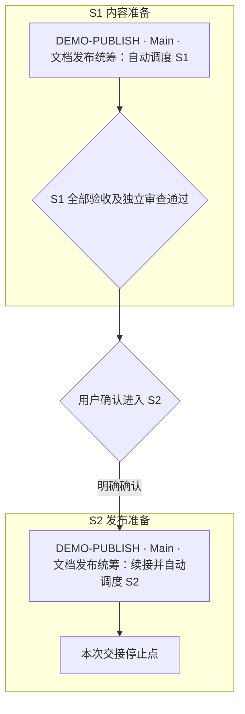

# 半自动：阶段内自动，阶段间确认

材料类型：手工编写的规则片段，不是完整可执行任务包；未实际启动这些会话。

## 输入条件

虚构父任务 `DEMO-PUBLISH` 要准备文档发布：S1 交付并独立审查快速开始和排障指南，S2 交付并独立审查文档索引和发布检查说明。用户已明确选择半自动模式，目标仓库及卡片仓库均为虚构的 `demo-publish`。

Main 名称为 `DEMO-PUBLISH · Main · 文档发布统筹`，卡片入口约定为该仓库根下的 `docs/task-packets/DEMO-PUBLISH/main.md`。本例中的坐标仅说明输出形式；实际执行需要完整生成的卡片与目标仓库。

## 阶段规则

| 阶段 | 任务与结果 | 退出条件 |
| --- | --- | --- |
| S1 内容准备 | DOC-01 快速开始；DOC-02 排障指南 | 两项验收与独立审查均通过 |
| S2 发布准备 | DOC-03 文档索引；DOC-04 发布检查说明 | 两项验收与独立审查均通过；完成本次交接，不发布 |

发送 Main 启动提示词只授权 S1。S1 完成后，Main 展示实际证据、问题及 S2 范围，等待用户明确确认；不创建或预热 S2 会话。选定半自动模式、用户沉默和 Reviewer 通过都不能代替该确认。

## 流程图节选

图中 Main 名称保持不变；阶段框和确认节点均不是新增会话。为便于阅读，此片段只展示 Main 阶段交接，实际任务包还必须画出各具名 Worker/Reviewer 及返修关系。



## 用户确认提示词示例

以下片段演示生成形式，不对应一个已存在的仓库：

```text
确认「DEMO-PUBLISH · Main · 文档发布统筹」以半自动模式进入 S2「发布准备」。从仓库 demo-publish 根读取 docs/task-packets/DEMO-PUBLISH/main.md，核对 S1 的验收和独立审查证据。授权在文档索引和发布检查说明两项任务范围内自动创建或续接名册中的会话；S2 完成后交付结果，本次不执行发布，也不将此次确认扩展到其他任务。
```

## 验收要点

- 确认明确指向下一阶段及具体范围。
- Main 恢复后需要读取实际批准记录，不能从阶段“待开始”推导批准。
- 当前阶段返修留在本阶段；跨阶段返工说明范围并按执行约定确认。
